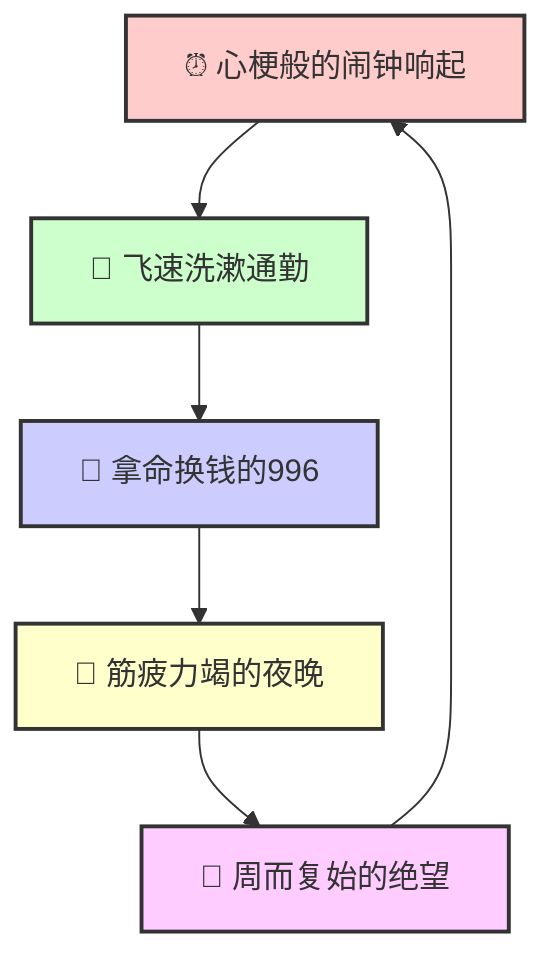

# 🧨 ==深度拆解：为什么我们活得像上了发条的工业零件？==

### 📝 核心引言

我们都在玩一场被精心设计的游戏：
**如果比赛规则注定是让大多数人输，那么最勇敢的举动不是拼命跑，而是换一种方式定义「终点」。** 

痛苦的根源不在于你不努力，
而在于你试图用**碳基生物**的血肉之躯，
去适配**硅基工业文明**的硬核逻辑。

---

> **与其在单一评价的水泥地上撞得头破血流，不如做一颗狡猾的种子：外表像那颗坚硬的螺丝钉，内心却偷偷开出一朵不被定义的花。**

## 🛑 第一节：痛苦的标准件人生

**这是一个不允许掉队的生产线。**

⏰ **生理性枯竭**

---

---

🏭 **社会化切割**

*   **中考/高考**：出厂合格证的初级筛选。
*   **大厂/体制**：按耐磨程度分类的高级零件。
*   **房/车/婚**：必须限时完成的**任务清单**，超时即废品。

📉 **评价体系的单行道**

社会只需要**高效、耐磨、去情绪化**的标准化零件。

若你有**多样性**（想流浪、想画画、想躺平），
在工业机器看来，这就是**次品**。

---

## ⚡ 第二节：看破那个巨大的局

为什么无论多努力都觉得不够？

🧠 **外部归因觉醒**

莫陷入自我攻击！这**非你的无能**，而是**系统性挤压**。

*   **游戏规则制定者**：少数既得利益者操控资源分配（房价、KPI）。

*   **内卷本质**：单车道拥挤。所有人都被赶上了同一条路，不是路难走，而是**不许变道**。

🧱 **失败的去魅**

当你没达到年薪百万、没买起市中心的房，
不代表你输了。这只意味着：
**你不适合做那颗最昂贵的螺丝钉，仅此而已。**

---

## 🛠️ 第三节：如何在单一体系中套利与存活

既然完全脱离现实会饿死，
那就做一个**聪明的双系统运作者**。

### 🎭 策略一：生存伪装与认知隔离

别把灵魂交给工作，把工作当成**矿区**。

*   **工具理性（对内）**：在这个体系里赚钱、社保、买房，只是为了获取生存资源。这是**采集过程**，无关尊严。

*   **价值剥离（对外）**：老板的PUA、升职失败、买不起豪宅 ➔ 这些只是**零件磨损**，不代表**你这个人很差劲**。

*   **行动指南**：在这个系统里做到**及格偏上**即可，省下试图争第一而消耗的巨额精力。

---

### 🏋️ 策略二：人生杠铃策略

**极度保守 + 极度疯狂 = 稳健的自由**

*   🔴 **左端（保守）**：一份不一定热爱但能糊口、有社保、甚至枯燥的稳定工作。这是你的**底盘和掩体**。

*   🟢 **右端（疯狂）**：利用底盘提供的闲暇和资金，去极度投入你的**真正热爱**（写作、登山、穷游、钻研昆虫）。

*   **核心逻辑**：利用束缚提供的**确定性**，来滋养另一端的**多样性**。

---

### ⛺ 策略三：构建微观部落生态

如果14亿人的价值观让你窒息，
那就只要**5个人的认可**。

*   **建立飞地**：寻找那个不论房子车子，只论才华、趣味、善良的**小圈子**。

*   **精神氧舱**：在社会的大染缸里闭气，回到你的小部落里呼吸。

*   **重新定义道具**：房子不再是**成功标志**，而是存放你肉身和爱好的**容器**。如果租房也能做容器，那就别背负30年的枷锁。

---

## 🚀 结语：做一只聪明的寄居蟹

不要试图用脆弱的肉身去硬刚坚硬的体制。
你要学会做一只**聪明的寄居蟹**：

🛡️ **外表**：包裹着符合世俗标准的坚硬外壳（有工作、懂人情、能生存），保护自己不被碾压。

🔥 **内核**：在深夜、在周末、在你构建的精神飞地里，**狂野地生长那个不被定义的自己**。

**只要你的灵魂没有被同化，这场游戏，你就不算输。**