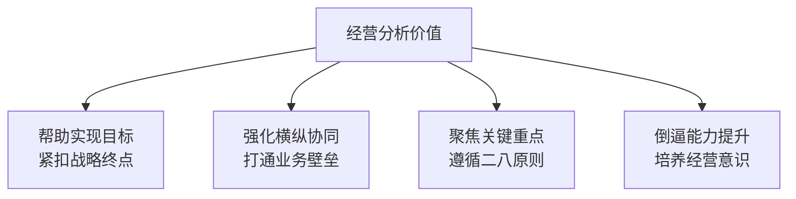
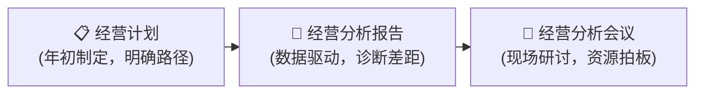
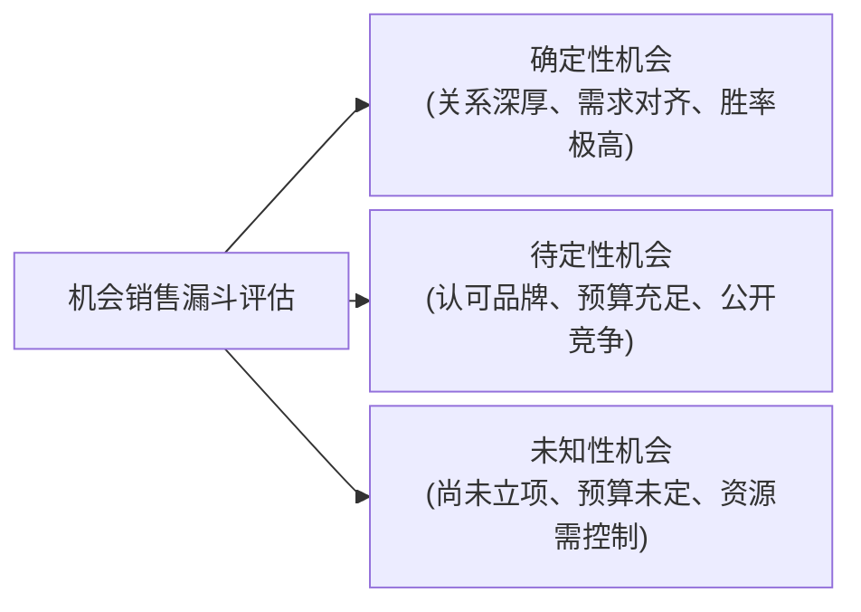
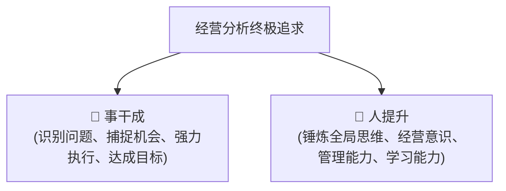

# 🚀 精益经营分析：从战略蓝图到沙场胜果

💡 **核心引言**：

经营分析不是枯燥的财务报表朗读会，而是数据与业务场景的双向奔赴。真正的经营分析，是拿着显微镜找差距，拿着放大镜找机会。

👁️ **关键洞察**：

1. **数据可见是基础，业务场景是灵魂**：没有业务场景的数据只是冷冰冰的数字，经营分析必须穿透数字、直达真实战场。
2. **不仅要向后看差距，更要向前看机会**：分析不能止步于过去的得失，必须通过对确定、待定和未知机会的分类评估，提前布局未来。
3. **事干成的同时，人必须提升**：每一次深度的业务剖析，都是培养干部全局思维、经营意识和管理能力的沙场练兵。

---

## 📌 一：经营分析的底层逻辑

在战役中，通过每日战况的细致盘点，能从缴获武器的比例异常中洞察敌军指挥部的具体位置。

在商场中，**经营分析的价值**同样在于从纷繁复杂的业务数据中提取核心线索，辅助精准决策。

### 📅 四大核心会议：从战略到执行的闭环

经营分析并非孤立存在，它是企业四大会议生命线中的关键一环：

---

| 会议类型      | 核心关注点       | 召开频次  | 核心价值        |
| :-------- | :---------- | :---- | :---------- |
| **战略澄清会** | 明确未来方向与战略意图 | 每年一次  | 达成共识，明确方向   |
| **战略解码会** | 将大目标拆解为具体动作 | 每年一次  | 明确路径，责任到人   |
| **经营分析会** | 过程控制与滚动计划更新 | 月度或季度 | 暴露风险，协调资源   |
| **干部述职会** | 评估日常业绩与个人能力 | 定期进行  | 评价干部，提升管理能力 |

### 🌟 经营分析的四大价值

---

## 📊 二：落地抓手：三个一机制

高效的经营体系，依托于三个核心工具的层层递进与无缝衔接。

### 1. 📋 经营计划：目标拆解的指南针
每个业务部门的经营计划都需要遵循**目标-策略-行动-监控**的设计原则，明确回答以下问题：
* **部门定位与职责**：我们是谁，核心责任是什么？
* **具体指标与路径**：财务、市场、产品分别要达成什么目标？
* **所需资源与能力**：实现目标需要匹配哪些人力、物力及关键技能？

---

### 2. 📃 经营分析报告：数据会说话的诊断书
一份完整的分析报告必须结构严密，由以下五大部分组成：

#### ① 🔄 上期回顾
* **动作**：对上期确定的重点任务进行性质判定（完成或未完成）。
* **分析**：对于未完成任务，必须深挖外部和内部原因，给出新对策、责任人和时间节点。
* **原则**：重点任务不超过10个，确保精力聚焦。

#### ② 🔍 经营审视
* **财务全景图**：运用财务指标综合分析法，全方位评估公司的盈利能力与资产健康度，生成数字化经营看板。
* **指标雷达图**：精选5到7个核心绩效指标，对比预算值、历史值和对标值，直观呈现当前运行状态。
* **重点任务甘特图**：以可视化的时间轴跟进重点项目的落地进度。

---

#### ③ ⚠️ 差距分析
从三个维度精准定位经营漏洞：
* **业绩差距**：实际业绩与预期目标之间的硬性差距。
* **对标差距**：自身表现与行业水平或竞争对手的优劣差距。
* **能力差距**：目标可行但执行变形，背后暴露的组织或流程短板。

💡 **根因诊断法**：利用连续追问为什么的分析工具，逐层剥离表象，直击问题本质。
> * *案例*：机器因超载烧断保险丝 -> 因为轴承润滑不足 -> 因为润滑泵失灵 -> 因为轮轴磨损 -> 因为杂质进入。最终对策：在润滑泵上加装滤网。

---

#### ④ 🔮 业绩预测
* **绘制蓝图**：将企业的核心技术主线与客户的真实应用场景深度结合。
* **机会分类评估**：

---

#### ⑤ 🚀 重点任务
* **来源**：来源于上期遗留问题、差距分析的短板、以及业绩预测中的大机会。
* **落地标准**：确保机会、目标、策略、行动和资源五个要素高度一致。

### 3. 👥 经营分析会议：决策拍板的作战室

报告是载体，高水平的会议才是产生管理闭环的决胜地。

#### ❌ 坚决避免五个误区
1. **只讲成绩不讲问题**：开成表彰大会，掩盖隐患。
2. **只讲困难不讲对策**：只抱怨环境，没有解决方案。
3. **只讲现象不谈根因**：浮于表面，无法对症下药。
4. **只谈过去不看未来**：缺乏前瞻预测，无法提前布局。
5. **只讲数字不谈场景**：缺乏业务逻辑，沦为数字游戏。

---

#### 🎯 牢记三聚焦原则
* **聚焦目标**：围绕结果、差距、策略行动与资源配置。
* **聚焦问题**：重点讨论业绩差距、经营风险及应对方案。
* **聚焦机会**：讨论支撑目标实现的各类机会清单及突破点。

#### ⚙️ 会议高效运行的五大铁律
* **时间要固定**：例行化管理，形成组织记忆。
* **层层自下而上**：基层解决的问题不上升，带着未解难题逐级上报。
* **管理部门主持**：管理或财务部门控场，业务部门自我剖析，高管进行点评和赋能。
* **严肃紧张的氛围**：让业绩不佳、行动不力的部门感受到压力，促成改进。
* **闭环跟进机制**：会后发布决议纪要，行动计划符合具体、量化、可行、相关、有时限的指标原则，并纳入后续跟踪。

---

## 🎯 三：两大核心追求

一切经营分析的终极目标，都可以归结为以下两个方向：

> 经营分析不是为了填表格、走流程，而是一场由**数据驱动**、考验领导力与协同能力的**组织进化**。

将每一个决策落到实处，方能确保企业在激烈的市场竞争中稳步前行。