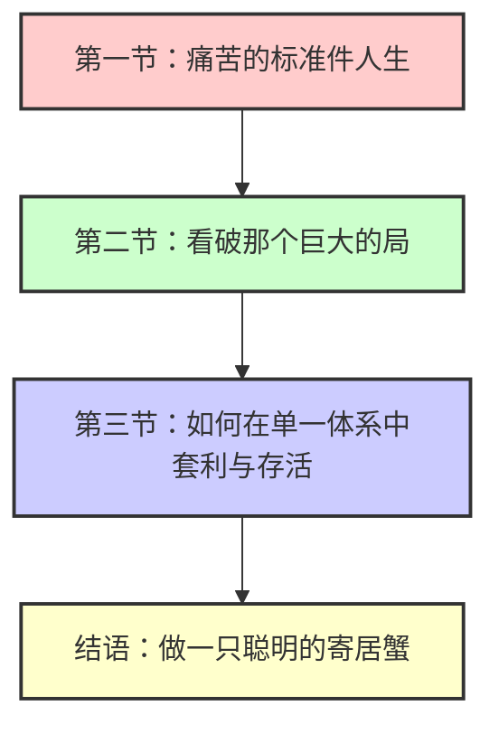

# 发现了吗？你的痛苦是被设计出来的

## 概述

本文是一篇自助/哲理类散文，核心论点是：现代人的痛苦源于**碳基生物**的血肉之躯被迫适配**硅基工业文明**的硬核逻辑。社会将人标准化为"零件"，单一评价体系的单行道让多样性被定义为"次品"。文章提出三合一的生存策略作为应对方案。

## 核心论点

1. **痛苦的根源是结构性设计**：工业文明将人零件化，痛苦是系统必然产物，而非个人失败。
2. **社会评价体系的单行道**：中考/高考→大厂/体制→房/车/婚，构成不允许变道的"单车道"。
3. **应对策略是三合一**：①认知隔离（工作只是矿区）②杠铃人生（保守+疯狂并行）③微观部落（5人认可代替14亿人评价）。

## 核心隐喻与策略框架

### 核心隐喻

> 与其在单一评价的水泥地上撞得头破血流，不如做一颗狡猾的种子：外表像那颗坚硬的螺丝钉，内心却偷偷开出一朵不被定义的花。

全文最终收敛于**寄居蟹**意象：外表包裹世俗外壳保护自己，内核在精神飞地里狂野生长。

### 三阶段论证结构

### 三段式策略详解

| 策略 | 核心操作 | 关键区分 |
|------|----------|----------|
| 生存伪装与认知隔离 | 工作=矿区采集，老板PUA=零件磨损 | 工具理性对内，价值剥离对外 |
| 人生杠铃策略 | 左端保守（糊口工作）+ 右端疯狂（真正热爱） | 用确定性滋养多样性 |
| 微观部落生态 | 5人认可代替14亿人评价，以才华/趣味/善良为标准 | 房子是容器而非成功标志 |

## 证据强度评估

- **证据类型**：逻辑论证 + 经验观察 + 隐喻类比
- **引用来源**：无实证数据或学术研究引用
- **强度评价**：**弱**。属于自助/哲理类散文，依赖修辞和类比而非严谨论证。"房价/KPI由既得利益者操控"等说法缺乏数据支撑。

## 与已有Wiki内容的关联

- [[concepts/归因模式改变与个人主观能动性的认知张力]] — 本文是"外部归因"立场的鲜明例证
- [[synthesis/从应激防御到生态位升级]] — 寄居蟹策略可视为防御到生态位的过渡形态
- [[concepts/不介入他人剧本-vs-共同体感觉]] — 微观部落与共同体感觉的兼容性待考察
- [[concepts/课题分离与反脆弱]] — 认知隔离策略与阿德勒课题分离的异同
- [[concepts/特化vs全能]] — 杠铃策略作为"特化于两个极端"而非中间地带的形式

## 内部张力与开放问题

1. **系统批判 vs 系统套利**：文章一方面批判工业体系将人零件化，另一方面教读者"在体系内聪明地套利"——这是否默认接受了系统的不可改变性？
2. **外部归因的边界**：将一切归因于"系统设计"可能滑向另一种决定论，削弱个人能动性。
3. **"5人认可"的现实可行性**：在原子化社会中，找到这样的微观部落本身就是一种特权或运气。

## 关键原文摘录

> 如果比赛规则注定是让大多数人输，那么最勇敢的举动不是拼命跑，而是换一种方式定义「终点」。

> 不要试图用脆弱的肉身去硬刚坚硬的体制。你要学会做一只聪明的寄居蟹：外表包裹着符合世俗标准的坚硬外壳，内核在深夜、在周末、在你构建的精神飞地里，狂野地生长那个不被定义的自己。

> 只要你的灵魂没有被同化，这场游戏，你就不算输。
